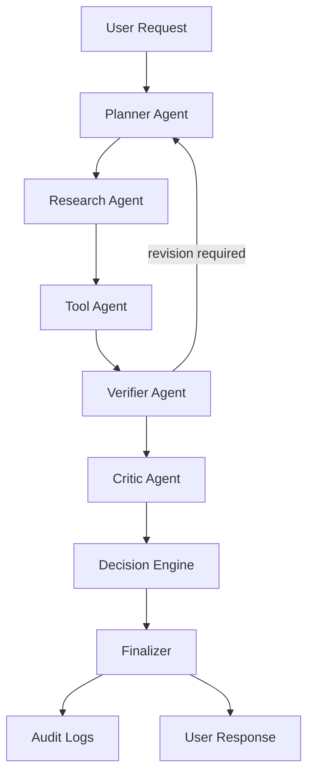

# VeriMind AI

VeriMind AI is an enterprise-grade multi-agent reasoning and verification platform designed for evidence-backed answers, safe failure, and independent validation. Instead of a general-purpose chatbot, every response is produced through a structured workflow of planning, retrieval, tooling, verification, criticism, and finalization.

## Overview

The platform is built to satisfy the following principles:

- independent verification
- evidence-grounded reasoning
- structured outputs
- self-correction
- auditability
- safe failure

## Architecture



## Stack

- Frontend: Next.js 15, TypeScript, Tailwind CSS, ShadCN-style UI, Framer Motion, Recharts
- Backend: FastAPI, Pydantic, LangGraph-ready orchestration, async endpoints
- Database: PostgreSQL + Supabase + pgvector
- AI: Gemini 2.5 Flash with structured JSON tool calling
- Sandbox: Docker-based isolated execution

## Deployment Targets

- Frontend: Vercel
- Backend: Railway
- Database: Supabase

### Public deployment

The repository includes [`render.yaml`](./render.yaml) for deploying the backend API to Render and [`vercel.json`](./vercel.json) for deploying the Next.js frontend to Vercel. Deploy the backend first, then set `NEXT_PUBLIC_API_URL` in the Vercel project to the deployed backend URL.

For a no-cost frontend-only demo, enable GitHub Pages for the repository using the `GitHub Actions` source. The included `.github/workflows/deploy-pages.yml` builds and publishes the static frontend automatically. The Pages URL will be `https://karthikeyanama.github.io/hackthon/`.

## Quick start

```bash
docker compose up --build
```

Then open the frontend at http://localhost:3000 and the API at http://localhost:8000/docs.

For the jury demo, open http://localhost:3000/verify. This page lets you enter a question, run the verification workflow, and inspect the decision, confidence, evidence, verification results, warnings, and revision count. It includes presets for a successful API check, an incorrect-math check, and a fake-API rejection test.

## Key features

- multi-agent orchestration with independent verification
- evidence retrieval and citation tracking
- contradiction detection and hallucination risk scoring
- automatic revision loops and final rejection safeguards
- audit timeline and evaluation dashboard
- benchmark framework for verification tasks

## Project structure

```text
verimind-ai/
├── frontend/
├── backend/
├── shared/
├── docs/
├── evaluation/
├── screenshots/
├── docker/
├── README.md
├── docker-compose.yml
├── .env.example
└── .gitignore
```

## API documentation

Swagger is available from the backend at `/docs`.

## Environment variables

See `.env.example` for required environment configuration.

## Demo workflow

A sample request can ask: "Verify whether this API exists." The system will:

1. plan the investigation
2. research evidence
3. use the tool agent to validate the API call
4. verify claims independently
5. revise if evidence conflicts
6. deliver only a verified answer

## Team

- Principal AI Systems Architect
- Senior Backend Engineer
- Full-stack Product Engineer
- Data & Safety Review Lead

## License

This project is intended for hackathon demonstration and internal enterprise evaluation.
